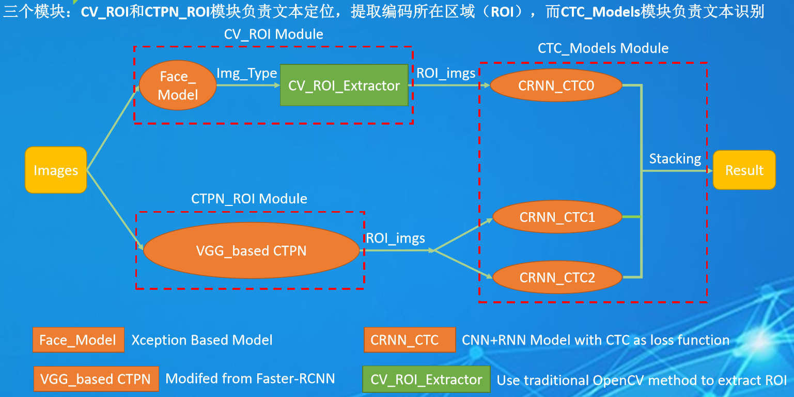

# RMB_TechDing

这是TinyMind人民币编码识别竞赛，第三名（团队名：TechDing）的代码，欢迎大家下载交流。

具体竞赛内容和排名请查看官网网址：https://www.tinymind.cn/competitions/47

### 核心思想：

### 使用方法：

1. 首先vim打开config.cfg，设置src_imgs_folder为需要预测的图片文件夹目录，
    里面的所有jpg图片都会识别其编码，其他类型的图片不会识别。
    设置final_csv_path为识别完成之后的csv结果的路径，必须以.csv结束。
    上面两个路径最好都是绝对路径。

2. 开始运行：直接用 python Main.py即可运行，如果一切顺利，最终会打印出 "GOOD!. All Finished!!!"信息，
    且最终的预测结果保存到final_csv_path指向的路径。

3. 注意：经测试，本项目可以运行在：Ubuntu1604系统, Python 3.6，tensorflow-gpu==1.13.1,keras==2.2.4, numpy,pandas等.
    其他tensorflow-gpu版本或keras版本可能运行正常，但不确定。
    在Windows下无法运行。
    在预测时默认使用第0个GPU来运行，需要注意该GPU没有被其他应用程序占用。

### 数据下载：

决赛数据集下载地址：
https://www.tinymind.cn/link/oss?bucketName=tinymind-competition&objectName=rmb/private_test_data.zip

面值识别挑战数据下载地址：https://pan.baidu.com/s/1oZ4yMlTU3YwnX9KR0huzyQ 提取码：k7bc

如果百度网盘下载慢，可以通过以下链接下载训练集\测试集（其他内容需从百度网盘下载）：
12G训练集：https://drive.google.com/drive/folders/1ZWhydsGit1pRNhMRiqpSGV6dPQbYbZFn

4G测试集：https://drive.google.com/drive/folders/1L6dB3jSJ6eVpdCw-XCL2c8LUOeu87QQ_

人民币编码识别挑战预赛数据集下载地址：https://pan.baidu.com/s/1UDkxZSbLA96D8LGnNap5Bw 提取码：bff8
